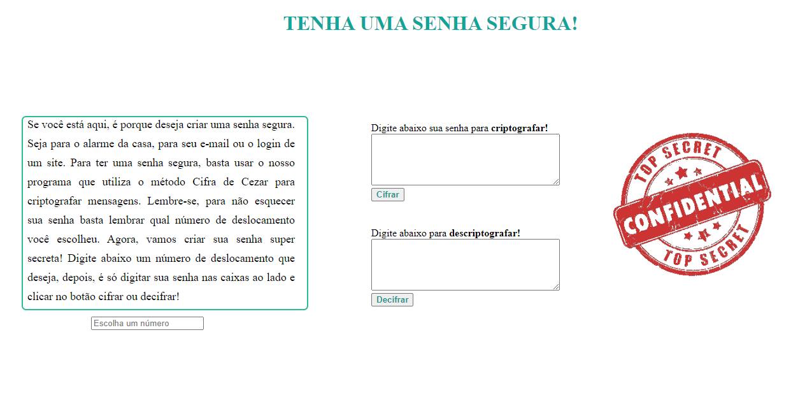

# Tenha uma senha segura
Aplicação web feita no primeito projeto do _bootcamp_ da **Laboratória**. Essa aplicação permite ao usuário tornar uma senha simples em uma senha segura, utilizando uma criptografia chamada Cifra de César. Assim, o usuário poderá navegar tranquilamente na web, sem medo do ataque de hackers. O usuário também poderá utilizar a ferramenta para decifrar sua senha.

## Índice

* [1. Sobre o projeto](#1-sobre-o-projeto)
* [2. Definição do Usuário](#2-definição-do-usuário)
* [3. Instruções e explicação de uso](#3-instruções-e-explicação-de-uso)
* [4. UX / UI](#4-ux-/-ui)
* [5. Objetivos de aprendizagem](#5-objetivos-de-aprendizagem)
* [6. Critérios de aceitação mínimos do projeto](#6-critérios-de-aceitação-mínimos-do-projeto)

## 1. Sobre o projeto

O usuário poderá cifrar e decifrar uma senha, indicando a chave de deslocamento (offset).

**"Tenha uma senha segura"** utiliza a técnica de criptografia denominada "Cifra de César", um tipo de cifra de substituição na qual cada letra do texto é substituída por outra (de acordo com o número de deslocamento que o usuário escolher).

A funcionalidade do projeto é uma aplicação web para um usuário que deseja ter uma senha mais segura, podendo navegar tranquilamente. Por exemplo: um usuário quer usar o nome do seu animal de estimação como senha. São senhas muito fáceis de se descobrir, e por isso o programa permite ao usuário continuar usando essas senhas, porém de forma cifrada utilizando um número de deslocamento, tornando-as seguras.

## 2. Definição do Usuário
Os principais usuários do produto são pessoas com dificuldade para elaborar senhas seguras. Ao acessar a aplicação web, o usuário poderá inserir senhas como o nome do seu animal de estimação, do seu companheiro ou qualquer outra palavra. 

O produto resolve o problema do usuário ao criar uma nova senha segura, podendo o mesmo navegar tranquilamente sem receio de ataques de hackers em suas contas online. 

## 3. Instruções e explicação de uso

A cifra de César é uma das técnicas mais simples de cifrar uma mensagem. É uma cifra por substituição, em que cada letra do texto original é substituida por outra que se encontra em um número fixo de posições (deslocamento) mais a frente do mesmo alfabeto.

Por exemplo, se o usuário deseja cifrar o nome de sua gata chamada Polly, e utilizar o deslocamento (offset) de 3 posições:

* Alfabeto sem cifrar: A B C D E F G H I J K L M N O P Q R S T U V W X Y Z
* Alfabeto com cifra:  D E F G H I J K L M N O P Q R S T U V W X Y Z A B C
* A letra A será D
* A palavra POLLY será SROOB

Sendo assim, a senha segura com o nome do animal de estimação do usuário será: SROOB

O método para cifrar e decifrar funciona apenas para senhas que contenham letras do alfabeto, sejam maiúsculas ou minúsculas. Caracteres especiais e números retornam eles mesmos, sem o deslocamento.

Caso o usuario venha a esquecer qual a senha criptografada (por tornarem-se letras aleatórias e sem sentido) ele poderá deixar anotado a palavra e o número de deslocamento que usou para cifrar. Assim, poderá revisitar o site para cifrar e obter novamente sua senha segura. Ele também pode conferir no campo "decifrar" se sua senha mega secreta retorna a senha inicial. 

## 4.  UX / UI
* Interface

Foi utilizada uma interface simples, com um texto inicial orientando os passos para obter a senha segura. Possui opção do usuário escolher o número de deslocamento, 2 janelas para inserir a mensagem para ser cifrada ou decifrada, retornando o resultado no mesmo lugar. E dois botões, um para cifrar e o outro decifrar. Também foi implementado uma imagem com os dizeres "Top Secret - Confidential", em vermelho. 

## 5. Objetivos de aprendizagem

Neste projeto devemos aprender a construir uma aplicação web (WebApp) que irá
interagir com o usuário final através do navegador utilizando HTML, CSS e
JavaScript como ferramentas.

### HTML e CSS

* [ ] [Uso de HTML semântico.](https://developer.mozilla.org/pt-BR/docs/Glossario/Semantica#Sem%C3%A2ntica_em_HTML)
* [ ] Uso de seletores de CSS.

### DOM

* [ ] Uso de seletores do DOM.
* [ ] Manipular eventos do DOM.
* [ ] [Manipulação dinâmica do DOM.](https://developer.mozilla.org/pt-BR/docs/DOM/Referencia_do_DOM/Introdu%C3%A7%C3%A3o)
(appendChild |createElement | createTextNode| innerHTML | textContent | etc.)

### JavaScript

* [ ] Manipulação de strings.
* [ ] Uso de condicionais (if-else | switch | operador ternário)
* [ ] Uso de laços (loops) (for | for..in | for..of | while)
* [ ] Uso de funções (parâmetros | argumentos | valor de retorno)
* [ ] Declaração correta de variáveis (const & let)

### Testing

* [ ] [Teste unitário.](https://jestjs.io/docs/pt-BR/getting-started)

### Estrutura do código e guia de estilo

* [ ] Organizar e dividir o código em módulos (Modularização)
* [ ] Uso de identificadores descritivos (Nomenclatura | Semântica)
* [ ] Uso de linter (ESLINT)

### Git e GitHub

* [ ] Uso de comandos de git (add | commit | pull | status | push)
* [ ] Gerenciamento de repositorios de GitHub (clone | fork | gh-pages)

### UX

* [ ] Desenhar a aplicação pensando e entendendo o usuário.
* [ ] Criar protótipos para obter feedback e iterar.
* [ ] Aplicar os princípios de desenho visual (contraste, alinhamento, hierarquia)

## 6. Critérios de aceitação mínimos do projeto

Use o alfabeto simples (somente maiúsculas e sem ç).