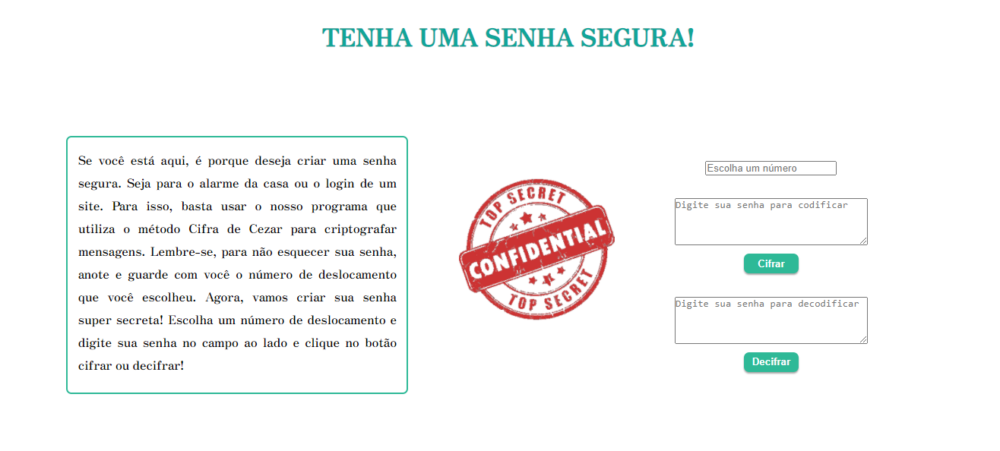
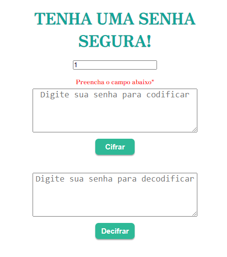

# Tenha uma senha segura
Aplicação web feita no primeito projeto do _bootcamp_ da **Laboratória**. Essa aplicação permite ao usuário tornar uma senha simples em uma senha segura, utilizando uma criptografia chamada Cifra de César. Assim, o usuário poderá navegar tranquilamente na web, sem medo do ataque de hackers. O usuário também poderá utilizar a ferramenta para decifrar sua senha.

## Índice

* [1. Sobre o projeto](#1-sobre-o-projeto)
* [2. Definição do Usuário](#2-definição-do-usuário)
* [3. Instruções e explicação de uso](#3-instruções-e-explicação-de-uso)
* [4. UX / UI](#4-ux-/-ui)
* [5. Checklist de Objetivos](#5-checklist-de-objetivos)

## 1. Sobre o projeto

O usuário poderá cifrar e decifrar uma senha, indicando a chave de deslocamento (offset).

**"Tenha uma senha segura"** utiliza a técnica de criptografia denominada "Cifra de César", um tipo de cifra de substituição na qual cada letra do texto é substituída por outra (de acordo com o número de deslocamento que o usuário escolher).

A funcionalidade do projeto é uma aplicação web para um usuário que deseja ter uma senha mais segura, podendo navegar tranquilamente. Por exemplo: um usuário quer usar o nome do seu animal de estimação como senha. São senhas muito fáceis de se descobrir, e por isso o programa permite ao usuário continuar usando essas senhas, porém de forma cifrada utilizando um número de deslocamento, tornando-as seguras.

Vale ressaltar que também há o tratamento de erros caso o usuário esqueça de inserir sua senha ou a chave de deslocamento.

## 2. Definição do Usuário
Os principais usuários do produto são pessoas com dificuldade para elaborar senhas seguras. Ao acessar a aplicação web, o usuário poderá inserir senhas como o nome do seu animal de estimação, do seu companheiro ou qualquer outra palavra. 

O produto resolve o problema do usuário ao criar uma nova senha segura, podendo o mesmo navegar tranquilamente sem receio de ataques de hackers em suas contas online. 

## 3. Instruções e explicação de uso

A cifra de César é uma das técnicas mais simples de cifrar uma mensagem. É uma cifra por substituição, em que cada letra do texto original é substituida por outra que se encontra em um número fixo de posições (deslocamento) mais a frente do mesmo alfabeto.

Por exemplo, se o usuário deseja cifrar o nome de sua gata chamada Polly, e utilizar o deslocamento (offset) de 3 posições:

* Alfabeto sem cifrar: A B C D E F G H I J K L M N O P Q R S T U V W X Y Z
* Alfabeto com cifra:  D E F G H I J K L M N O P Q R S T U V W X Y Z A B C
* A letra A será D
* A palavra POLLY será SROOB

Sendo assim, a senha segura com o nome do animal de estimação do usuário será: SROOB

O método para cifrar e decifrar funciona apenas para senhas que contenham letras do alfabeto, sejam maiúsculas ou minúsculas. Caracteres especiais e números retornam eles mesmos, sem o deslocamento.

## 4.  UX / UI
* Interface

Foi utilizada uma interface simples, com um texto inicial orientando os passos para obter a senha segura. Possui opção do usuário escolher o número de deslocamento, 2 janelas para inserir a mensagem para ser cifrada ou decifrada, retornando o resultado no mesmo lugar. E dois botões, um para cifrar e o outro decifrar. Também foi implementado uma imagem com os dizeres "Top Secret - Confidential", em vermelho. 

Já para dispositivos mobile, retiramos o texto explicativo e deixamos a interface responsiva.

  

## 5. Checklist de Objetivos

- [ :white_check_mark:] Usar VanillaJS.
- [ :white_check_mark:] Interface que permita escolher o `offset` (chave de deslocamento) usava
  para cifrar/decifrar.
- [ :white_check_mark:] Interface que permita escrever um texto para ser cifrado.
- [ :white_check_mark:] Interface que mostre o resultado da cifra corretamente.
- [ :white_check_mark:] Interface que permita escrever um texto para ser decifrado.
- [ :white_check_mark:] Interface que mostre o resultado decifrado corretamente.
- [ :white_check_mark:] Cifrar/decifrar minúsculas.
